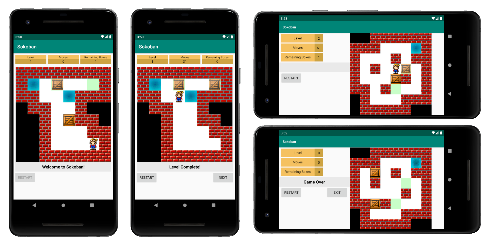

# Sokoban (POO Project)

## Overview
Sokoban is a puzzle video game genre in which the player pushes crates or boxes around in a warehouse, trying to get them to storage locations. The game is played on a board of squares, where each square is a floor or a wall. Some floor squares contain boxes, and some floor squares are marked as storage locations. 

This application was developed for Android with the use of a library provided by the teachers.

The game allows for custom levels to be designed through the [`levels.txt`](/Sokoban/app/src/main/assets/levels.txt) file.

## Preview

## Credits
This application was developed for the Object Oriented Programming class (2nd semester) at [ISEL](https://www.isel.pt/).

Developed by:
* [TiagoMMDavid](https://github.com/TiagoMMDavid)
* [PTKickass](https://github.com/PTKickass)
